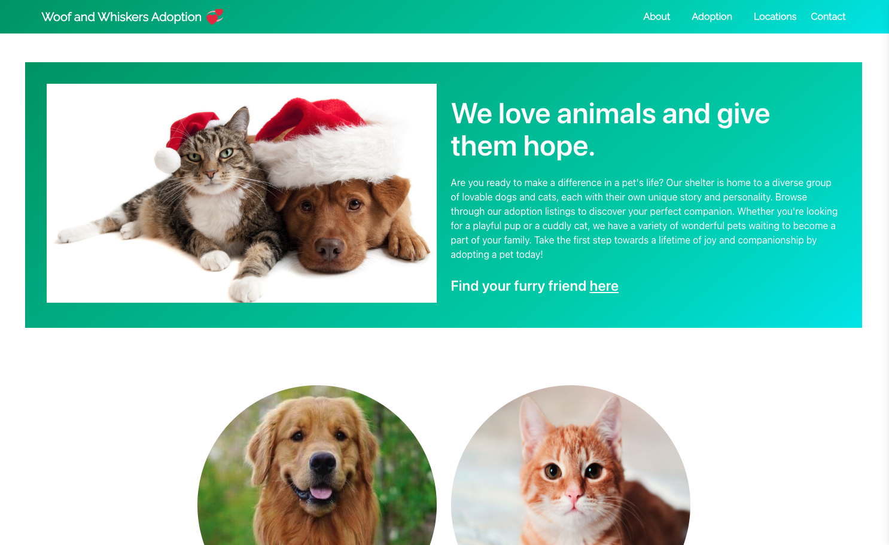

# [Woof and Whiskers Adoption](https://dogandcat-adoption-c23fc9844c3a.herokuapp.com/)
Woof and Whiskers Adoption is a platform that provides full CRUD functionality. Users can read, while administrators have the ability to read, create, update, and delete data. I utilize AWS for photo management and Heroku's PostgreSQL for secure data storage. 

## Technologies Used
- Python
- Django
- PostgreSQL
- Postico (for local database management)
- Amazon Web Services (AWS)
- Heroku's PostgreSQL
- Bulma CSS
- Heroku (for deployment)

## Getting Started
To access the deployed version of Woof and Whiskers Adoption platform, simply click on the following link: [Woof and Whiskers Adoption](https://dogandcat-adoption-c23fc9844c3a.herokuapp.com/)

Project Planning :- If you're interested in learning more about the planning and development process of this application which included User stories, Wireframes and Entity Relationship Diagrams(ERD), you can check out my [Trello board](https://trello.com/b/bSekNsA8/dog-and-cat-adoption-python-project)

### Installation steps for the app and dependencies
#### Clone the Repository:
git clone https://github.com/Apple-supaporn/project4-dog-and-cat-adoption

#### Navigate to the Project Directory:
cd project4-dog-and-cat-adoption

#### Set Up Virtual Environment:
- Create a virtual environment to isolate dependencies.  
python -m venv venv
- Activate the virtual environment.  
On Windows:  
.\venv\Scripts\activate  
On macOS/Linux:  
source venv/bin/activate

#### Install Dependencies:
pip install -r requirements.txt

#### Set up the database and apply migrations:
python manage.py migrate

#### Create a superuser to access the Django admin interface (Optional):
python manage.py createsuperuser

#### Run the Development Server:
python manage.py runserver

The site should be accessible at http://localhost:8000/ by default.

#### If you created a superuser, access the Django admin interface at 
http://localhost:8000/admin/ and log in.

## Screenshots
#### Landing Page

#### Adoption Page

#### Add a Pet Page

#### Pet Details Page

## Future Features
- As a visitor, I want to be able to inquire about adopting a pet by filling out a contact form.
- As an administrator, I want to review and approve adoption applications submitted by visitor.
- As a visitor, I want to share my happiness pet after I adopted.
- Success Stories Page that have collection of success stories.
- As a visitor, I want to see resources that I can look into for helping animals find homes.

